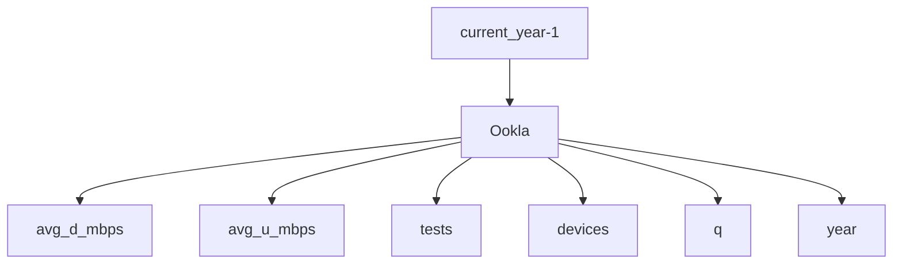

# sdc.broadband.ookla
Staging repository for extracting and chunking [ookla data](https://github.com/teamookla/ookla-open-data)

## Column Descriptions
Descriptions of columns [here](https://github.com/teamookla/ookla-open-data)
| Field Name        | Type        | Description                                                                                                                             | Notes                                                                                                                                                                              |
|-------------------|-------------|-----------------------------------------------------------------------------------------------------------------------------------------|------------------------------------------------------------------------------------------------------------------------------------------------------------------------------------|
| `avg_d_kbps`      | Integer     | The average download speed of all tests performed in the tile, represented in kilobits per second.                                      |                                                                                                                                                                                    |
| `avg_u_kbps`      | Integer     | The average upload speed of all tests performed in the tile, represented in kilobits per second.                                        |                                                                                                                                                                                    |
| `avg_lat_ms`      | Integer     | The average latency of all tests performed in the tile, represented in milliseconds                                                     |                                                                                                                                                                                    |
| `avg_lat_down_ms` | Integer     | The average latency under load of all tests performed in the tile as measured during the download phase of the test. Represented in ms. | Parquet-only. Added 2023-02-23 beginning in Q4 2022 dataset. This column is sparsely populated-- some rows will have a null value as not all versions of Speedtest can perform this measurement. |
| `avg_lat_up_ms`   | Integer     | The average latency under load of all tests performed in the tile as measured during the upload phase of the test. Represented in ms.   | Parquet-only. Added 2023-02-23 beginning in Q4 2022 dataset. This column is sparsely populated-- some rows will have a null value as not all versions of Speedtest can perform this measurement. |
| `tests`           | Integer     | The number of tests taken in the tile. |
| `devices`         | Integer     | The number of unique devices contributing tests in the tile. |
| `quadkey`         | Text        | The quadkey representing the tile.  |
| `tile_x`			| Numeric	  | X coordinate of the tile's centroid.| Added 2023-07-01 beginning in the Q2 2023 dataset.
| `tile_y`          | Numeric     | Y coordinate of the tile's centroid.| Added 2023-07-01 beginning in the Q2 2023 dataset.


## Example data
```python
              GEOID20  avg_d_mbps  avg_u_mbps  tests  devices  avg_lat_ms  year  q
0     130939701001026     174.795      16.958      4        3          24  2022  1
1     130939701001026     267.409      38.674      2        2          22  2022  1
2     130939701001026     209.803      17.265      1        1          16  2022  1
3     130939701001057     174.795      16.958      4        3          24  2022  1
4     130939701001048     174.795      16.958      4        3          24  2022  1
...               ...         ...         ...    ...      ...         ...   ... ..
1788  130939701001084     292.921     186.197     67       11         158  2022  4
1789  130939701001088       9.953       2.728      1        1         800  2022  4
1790  130939703001060      33.983       4.801      1        1         616  2022  4
1791  130939703001058      33.983       4.801      1        1         616  2022  4
1792  130939703001059      33.983       4.801      1        1         616  2022  4
```

## Graph

